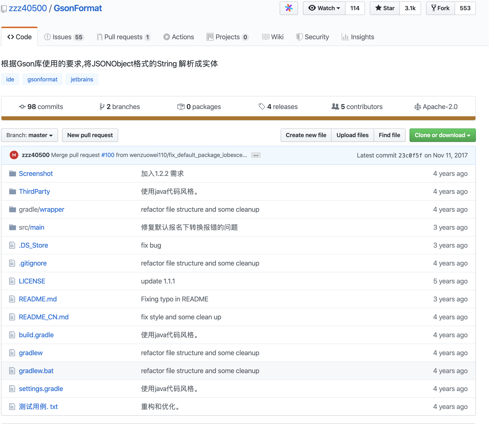
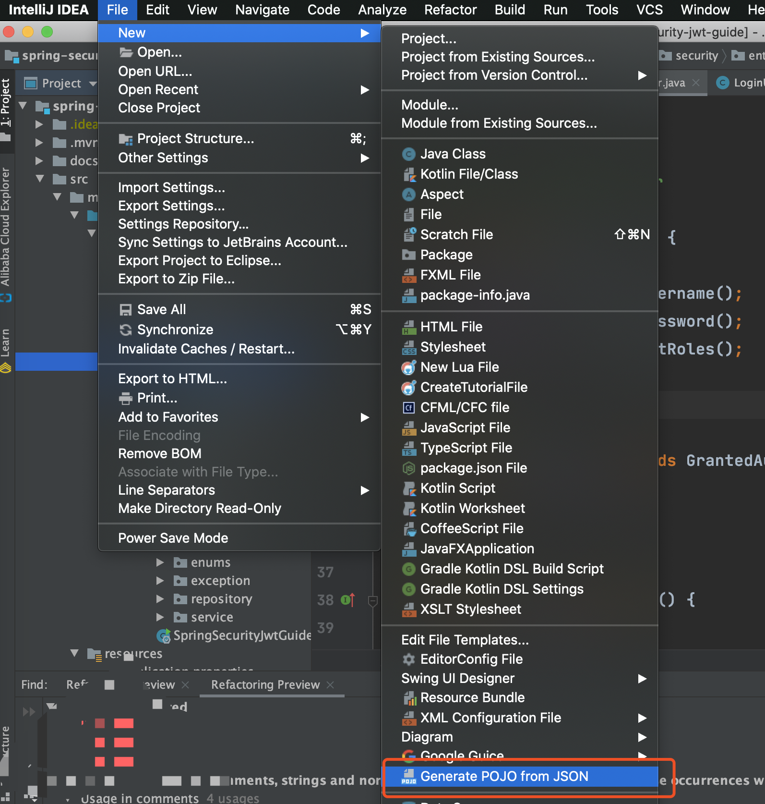
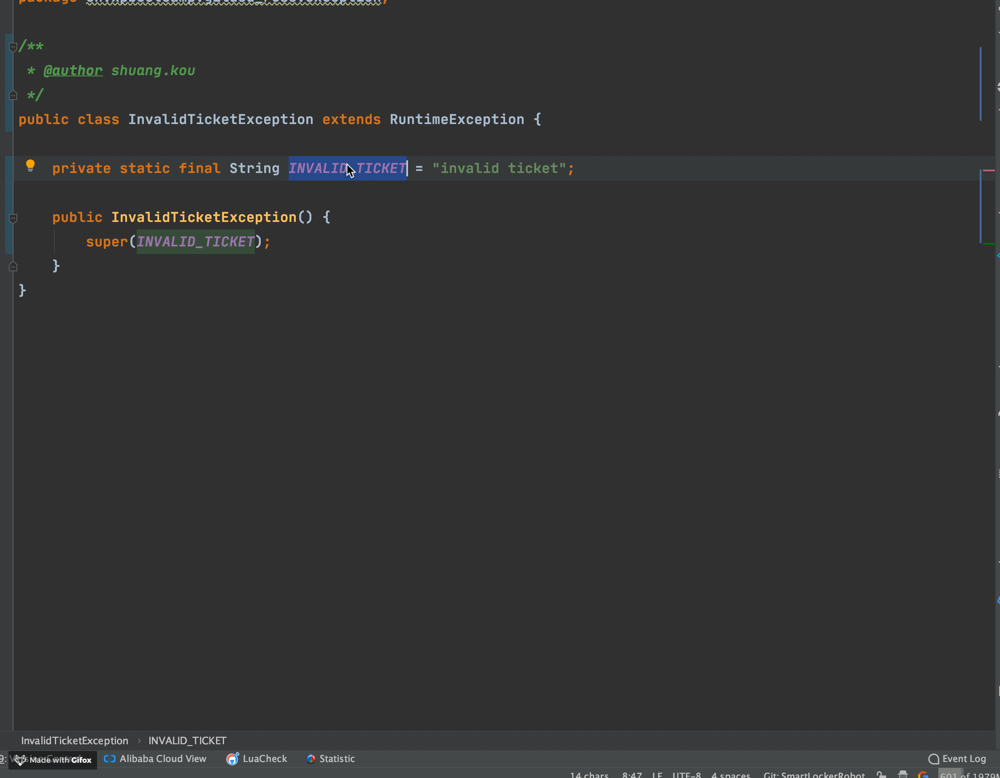

大家好，我是Guide哥，这篇文章中我会介绍10个非常不错的IDEA插件以及它们常见功能的使用方法。

>👉 **注意：这只是第一弹，后面的文章中，我会继续推荐一些我在工作中必备的 IDEA 插件以及他们的使用方法。**

**目录：**

<!-- TOC -->

- [IDE Features Trainer—IDEA交互式教程](#ide-features-traineridea%e4%ba%a4%e4%ba%92%e5%bc%8f%e6%95%99%e7%a8%8b)
- [GsonFormat+RoboPOJOGenerator—JSON转类对象](#gsonformatrobopojogeneratorjson%e8%bd%ac%e7%b1%bb%e5%af%b9%e8%b1%a1)
- [Translation-必备的翻译插件](#translation-%e5%bf%85%e5%a4%87%e7%9a%84%e7%bf%bb%e8%af%91%e6%8f%92%e4%bb%b6)
- [CamelCase-多种命名格式之间切换](#camelcase-%e5%a4%9a%e7%a7%8d%e5%91%bd%e5%90%8d%e6%a0%bc%e5%bc%8f%e4%b9%8b%e9%97%b4%e5%88%87%e6%8d%a2)

<!-- /TOC -->

### IDE Features Trainer—IDEA交互式教程

**有了这个插件之后，你可以在 IDE 中以交互方式学习IDEA最常用的快捷方式和最基本功能。** 非常非常非常方便！强烈建议大家安装一个，尤其是刚开始使用IDEA的朋友。	

当我们安装了这个插件之后，你会发现我们的IDEA 编辑器的右边多了一个“**Learn**”的选项，我们点击这个选项就可以看到如下界面。

我们选择“Editor Basics”进行，然后就可以看到如下界面，这样你就可以按照指示来练习了！非常不错！

### GsonFormat+RoboPOJOGenerator—JSON转类对象

这个插件可以根据Gson库使用的要求,将JSONObject格式的String 解析成实体类。

这个插件使用起来非常简单，我们新建一个类，然后在类中使用快捷键 `option + s`(Mac)或`alt + s` (win)调出操作窗口（**必须在类中使用快捷键才有效**），如下图所示。

这个插件是一个国人几年前写的，不过已经很久没有更新了，可能会因为IDEA的版本问题有一些小Bug。而且，这个插件无法将JSON转换为Kotlin（这个其实无关痛痒，IDEA自带的就有Java转Kotlin的功能）。 

另外一个与之相似的插件是 **：RoboPOJOGenerator** ，这个插件的更新频率比较快。

`File-> new -> Generate POJO from JSON`

然后将JSON格式的数据粘贴进去之后，配置相关属性之后选择“*Generate*”

### Translation-必备的翻译插件

有了这个插件之后，你再也不用在编码的时候打开浏览器查找某个单词怎么拼写、某句英文注释什么意思了。

并且，这个插件支持多种翻译源：

1. Google 翻译
2. Youdao 翻译
3. Baidu 翻译

除了翻译功能之外还提供了语音朗读、单词本等实用功能。这个插件的Github地址是：[https://github.com/YiiGuxing/TranslationPlugin](https://github.com/YiiGuxing/TranslationPlugin) （貌似是国人开发的，很赞）。

**使用方法很简单！选中你要翻译的单词或者句子，使用快捷键 `command+ctrl+u(mac)` / `shift+ctrl+y(win/linux)`** （如果你忘记了快捷的话，鼠标右键操作即可！）

**如果需要快速打开翻译框，使用快捷键`command+ctrl+i(mac)`/`ctrl + shift + o(win/linux)`**

如果你需要将某个重要的单词添加到生词本的话，只需要点击单词旁边的收藏按钮即可！

### CamelCase-多种命名格式之间切换

非常有用！这个插件可以实现包含6种常见命名格式之间的切换。并且，你还可以对转换格式进行相关配置（转换格式），如下图所示：

有了这个插件之后，你只需要使用快捷键 `shift+option+u(mac)` / `shift+alt+u` 对准你要修改的变量或者方法名字，就能实现在多种格式之间切换了，如下图所示：

如果你突然忘记快捷键的话，可以直接在IDEA的菜单栏的 Edit 部分找到。

使用这个插件对开发效率提升高吗？拿我之前项目组的情况举个例子：

我之前有一个项目组的测试名字是驼峰这种形式:`ShouldReturnTicketWhenRobotSaveBagGiven1LockersWith2FreeSpace` 。但是，使用驼峰形式命名测试方法的名字不太明显，一般建议用下划线_的形式：`should_return_ticket_when_robot_save_bag_given_1_lockers_with_2_free_space`

如果我们不用这个插件，而是手动去一个一个改的话，工作量想必会很大，而且正确率也会因为手工的原因降低。

> 👉 **注意：这只是第一弹，后面的文章中，我会继续推荐一些我在工作中必备的 IDEA 插件以及他们的使用方法。**

