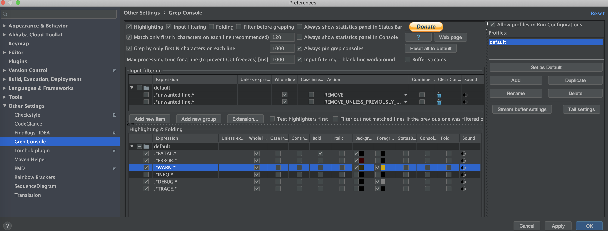
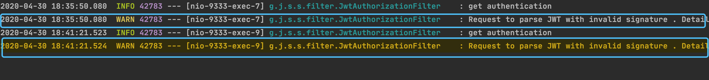
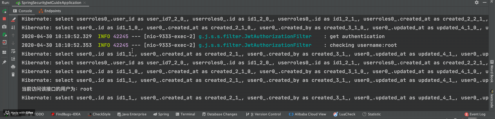
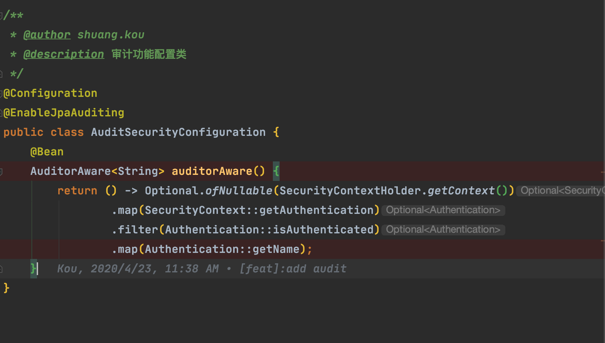
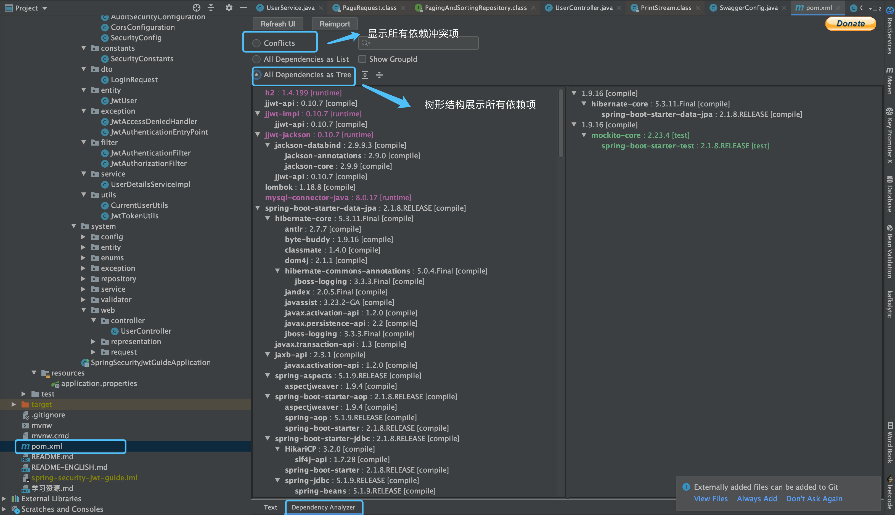
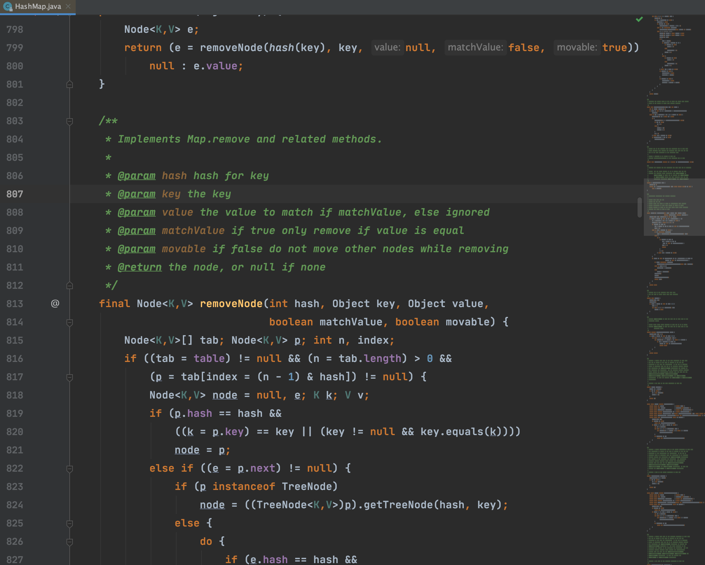
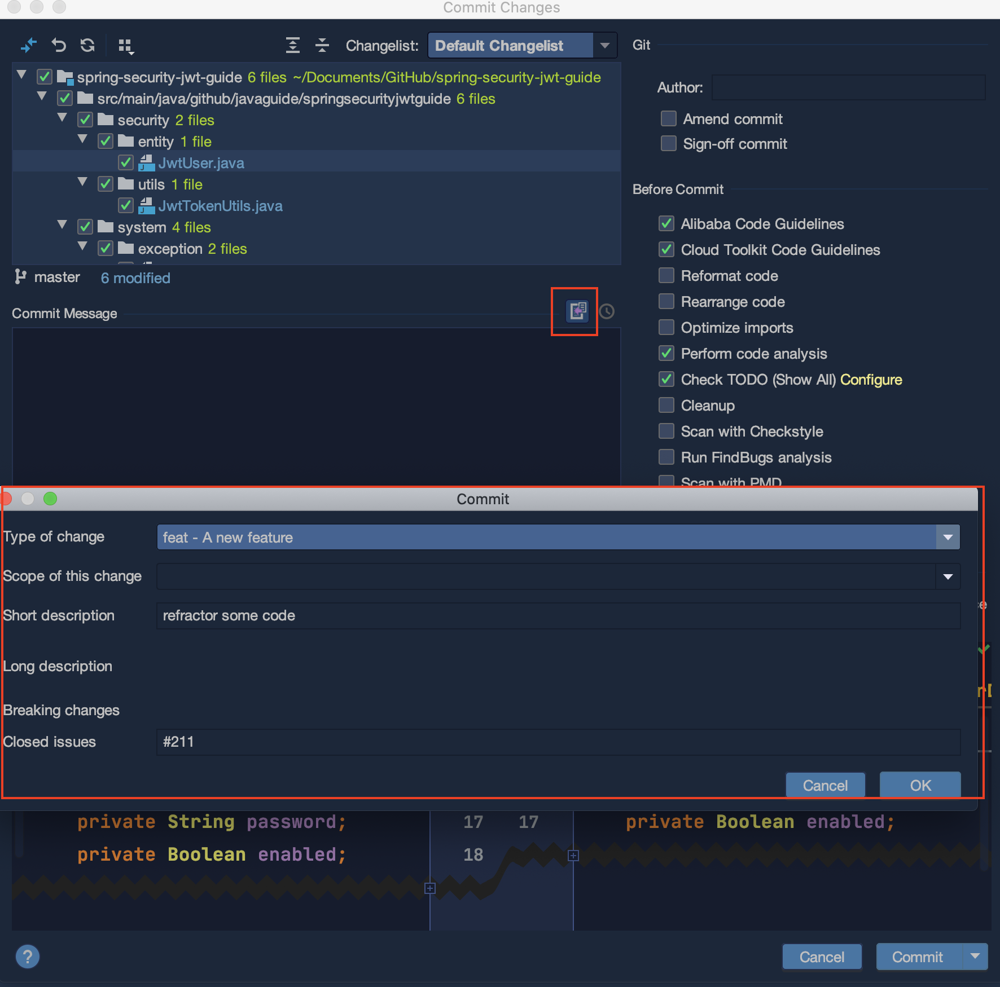

上一篇关于IDEA插件推荐的文章：[《第一弹！安排！安利10个让你爽到爆的IDEA必备插件！》](https://mp.weixin.qq.com/s?__biz=Mzg2OTA0Njk0OA==&mid=2247486586&idx=1&sn=b745f0be1a5fc0160f43625e29df9029&chksm=cea243b1f9d5caa7200950063ae9e1691d3578d46c0b865c8220c8f1e02ed43cb4e586c2524c&token=801835724&lang=zh_CN#rd)收到了很多小伙伴的好评，时隔大半个月左右，第二弹IDEA插件总算来啦！

下面推荐的插件都是我觉得比较实用的，不过你可以根据自己的需要适当进行选择。另外 IDEA 自带的很多插件如果没有用到的话都可以关掉，这样可以提高IDEA的运行速度。

**目录：**

- [Grep Console:控制台输出处理](#grep-console%e6%8e%a7%e5%88%b6%e5%8f%b0%e8%be%93%e5%87%ba%e5%a4%84%e7%90%86)
- [Rainbow Brackets:彩虹🌈括号](#rainbow-brackets%e5%bd%a9%e8%99%b9%f0%9f%8c%88%e6%8b%ac%e5%8f%b7)
- [Save Actions:优化保存操作](#save-actions%e4%bc%98%e5%8c%96%e4%bf%9d%e5%ad%98%e6%93%8d%e4%bd%9c)
- [Maven Helper:分析Maven项目的相关依赖](#maven-helper%e5%88%86%e6%9e%90maven%e9%a1%b9%e7%9b%ae%e7%9a%84%e7%9b%b8%e5%85%b3%e4%be%9d%e8%b5%96)
- [EasyCode:一键帮你生成所需代码](#easycode%e4%b8%80%e9%94%ae%e5%b8%ae%e4%bd%a0%e7%94%9f%e6%88%90%e6%89%80%e9%9c%80%e4%bb%a3%e7%a0%81)
- [Lombok:帮你简化代码](#lombok%e5%b8%ae%e4%bd%a0%e7%ae%80%e5%8c%96%e4%bb%a3%e7%a0%81)
- [CodeGlance:代码微型地图](#codeglance%e4%bb%a3%e7%a0%81%e5%be%ae%e5%9e%8b%e5%9c%b0%e5%9b%be)
- [Java Stream Debugger:Java8 Stream调试器](#java-stream-debuggerjava8-stream%e8%b0%83%e8%af%95%e5%99%a8)
- [Git Commit Template:使用模板创建commit信息](#git-commit-template%e4%bd%bf%e7%94%a8%e6%a8%a1%e6%9d%bf%e5%88%9b%e5%bb%bacommit%e4%bf%a1%e6%81%af)
- [其他常用插件推荐](#%e5%85%b6%e4%bb%96%e5%b8%b8%e7%94%a8%e6%8f%92%e4%bb%b6%e6%8e%a8%e8%8d%90)

### Grep Console:控制台输出处理

可以说是必备的一个IDEA插件，非常实用！

这个插件主要的功能有两个：

**1. 自定义设置控制台输出颜色**

我们可以在设置中进行相关的配置:



配置完成之后的 log warn 的效果对比图如下：



**2. 过滤控制台输出**



### Rainbow Brackets:彩虹🌈括号

使用各种鲜明的颜色来展示你的括号，效果图如下。可以看出代码层级变得更加清晰了，可以说非常实用友好了！



### Save Actions:优化保存操作

真必备插件！可以帮助我们在保存文件的时候：

1. 优化导入；
2. 格式化代码；
3. 执行一些quick fix
4. ......

这个插件是支持可配置的，我的配置如下：


实际使用效果如下：


### Maven Helper:分析Maven项目的相关依赖

主要用来分析Maven项目的相关依赖，可以帮助我们解决Maven依赖冲突问题。



**何为依赖冲突？**

说白了就是你的项目使用的2个jar包引用了同一个依赖h，并且h的版本还不一样,这个时候你的项目就存在两个不同版本的 h。这时Maven会依据依赖路径最短优先原则，来决定使用哪个版本的Jar包，而另一个无用的Jar包则未被使用，这就是所谓的依赖冲突。

大部分情况下，依赖冲突可能并不会对系统造成什么异常，因为Maven始终选择了一个Jar包来使用。但是，不排除在某些特定条件下，会出现类似找不到类的异常，所以，只要存在依赖冲突，在我看来，最好还是解决掉，不要给系统留下隐患。

### EasyCode:一键帮你生成所需代码

Easycode 可以直接对数据的表生成entity、controller、service、dao、mapper无需任何编码，简单而强大。


更多内容可以查看这篇文章：[《懒人 IDEA 插件插件:EasyCode 一键帮你生成所需代码~》](https://mp.weixin.qq.com/s?__biz=Mzg2OTA0Njk0OA==&mid=2247486205&idx=1&sn=0ff2f87f0d82a1bd9c0c44328ef69435&chksm=cea24536f9d5cc20c6cc7669f0d4167d747fe8b8c05a64546c0162d694aa96044a2862e24b57&token=1862674725&lang=zh_CN#rd)

### Lombok:帮你简化代码

之前没有推荐这个插件的原因是觉得已经是人手必备的了。如果你要使用 Lombok 的话，不光是要安装这个插件，你的项目也要引入相关的依赖。

```xml
        <dependency>
            <groupId>org.projectlombok</groupId>
            <artifactId>lombok</artifactId>
            <optional>true</optional>
        </dependency>
```

使用 Lombok 能够帮助我们少写很多代码比如 Getter/Setter、Constructor等等。

关于Lombok的使用，可以查看这篇文章：[《十分钟搞懂Java效率工具Lombok使用与原理》](https://mp.weixin.qq.com/s?__biz=Mzg2OTA0Njk0OA==&mid=2247485385&idx=2&sn=a7c3fb4485ffd8c019e5541e9b1580cd&chksm=cea24802f9d5c1144eee0da52cfc0cc5e8ee3590990de3bb642df4d4b2a8cd07f12dd54947b9&token=1667678311&lang=zh_CN#rd)。

### CodeGlance:代码微型地图

提供一个代码的微型地图，当你的类比较多的时候可以帮忙你快速定位到要去的位置。这个插件在我们日常做普通开发的时候用处不大，不过，在你阅读源码的时候还是很有用的，如下图所示：



### Java Stream Debugger:Java8 Stream调试器

Stream API 让你的代码更加优雅，但是有一个缺点是代码更难阅读和理解，没关系，这个插件应该可以帮助到你！


### Git Commit Template:使用模板创建commit信息

没有安装这个插件之前，我们使用IDEA提供的Commit功能提交代码是下面这样的：

 

使用了这个插件之后是下面这样的，提供了一个commit信息模板的输入框：

 

完成之后的效果是这样的： 

### 其他常用插件推荐

1. **leetcode editor** :提供在线 Leetcode 刷题功能，比较方便我们刷题，不过我试用之后发现有一些小 bug，个人感觉还是直接在网站找题目刷来的痛快一些。
3. **​A Search with Github** ：直接通过 Github搜索相关代码。
4. **stackoverflow** : 选中相关内容后单击右键即可快速跳转到 stackoverflow 。
5. **CodeStream** ：让code review变得更加容易。
6. **Code screenshots** ：代码片段保存为图片。
7. **activate-power-mode** :  写代码的时候自带动画效果！
8. **GitToolBox** :Git工具箱
9. **OK,​ Gradle!** ：搜索Java库用于Gradle项目
10. ......


